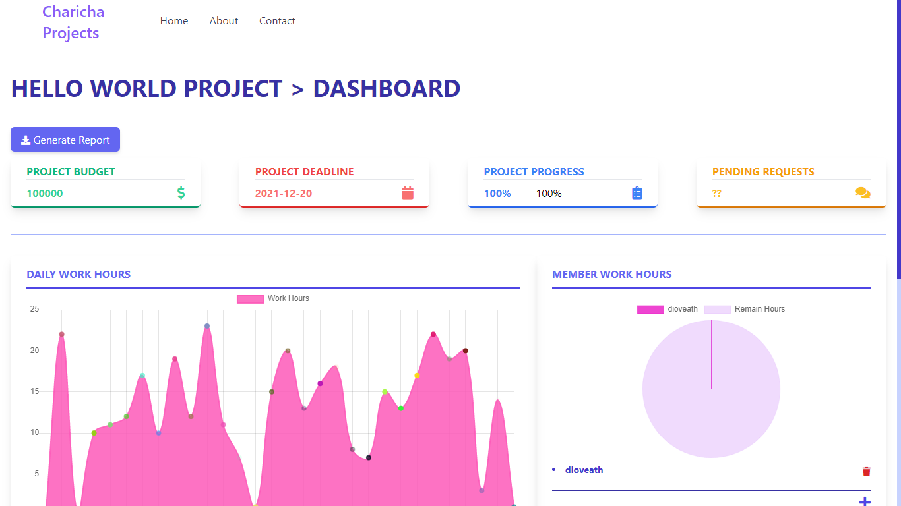
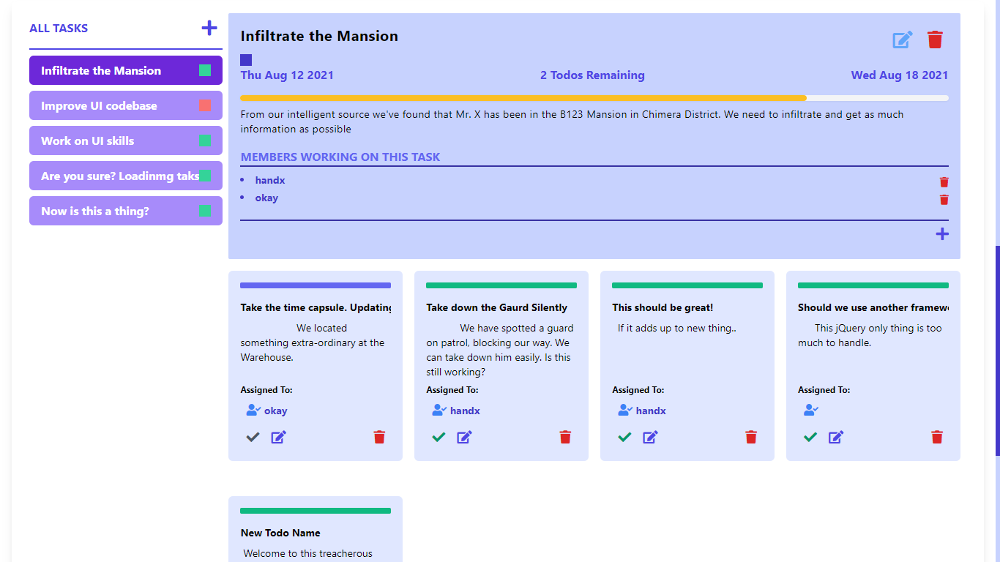

# Project Organizer
  Project Organizer helps to organize all the projects of Charicha. 

  

# Summary
  Helps organize our projects. 
  Features:
  - Dashboard containing all the project details. Project Time, budget, work completion, members in project.
  - Bar graph showing all the amount of works done for the days.
  - Pie Chart showing amount of works done by employee for the certain project.
  - Task System for managing all the tasks.
  - Managing progress through task and todos.

  Scenario: 
  It help to visualize how this project should be through
  example.
  - Our member will register at Project Organizer creating 'Member'.
  - He will create a project through form. He will add and define necessary properties and will be
    redirected to dashboard page of the project.
  - Then he can add tasks and assign them to required for the specific member, or multiple members
    to complete.
  - Then the assigned members can create small todos and complete them.
  - Overall at the end, project will be complete.
  
# Techonologies Used

## Tech Stack
| Front-End           | Back-End         | Tools   |
|---------------------|------------------|---------|
| HTML + JavaScript   | NodeJS + Express | npm     |
| Tailwind CSS        | MySQL            | PostMan |
| EJS Template Engine |                  | Emacs   |
| jQuery              |                  |         |

## Technical Implementations 
- REST API for managing all projects, tasks, todos, members, etc.
- Custom JWT Stateless Authorization with REST API 
- Custom State Management for Front-end UI in Vanilla JS with jQuery

# Entities

## Project
- title - The title of the project
- description - The summary of the project
- budget - Financial budget of the project
- start_date - Starting date of the project, i.e - when will the project will start
- end_date - End date or deadline date, i.e - when should the project should be finished by
- efforts_put(Working Hrs) - Working hours put to the project

## Task
- title - The title of the task,
- description - The summary of the task,
- start_date - When will the task should be started,
- end_date - End date or deadline date for which the task should be finished,
- efforts_put(Working Hrs) - Hours put to the tasks

## Todo
Todo is the smallest thing you can do.So, we can approximate effort in work hours needed
to complete the todo. This is the last leaf in this hierarchy.

## Member

## Documentation - Doc Table ??

## Task System | Entity Status

Project is tracked based on completion of tasks. Tasks is in turn tracked based on todos.
  

#### ACTIVE - 0
	When the entity is currently active. For. e.g- Todo is active, Task is active..

#### PENDING - 1
	When the entity after member submit the entity or entity's end_date crossed is currently
	waiting for affirmation from project_manager or admin to be complete or delegate or abandoned.

#### COMPLETE - 2
	When the given entity has been complete.

#### DELEGATED - 3
	When the given entity has been halted for time being.

#### ABANDONED - 4
	When the entity has been erased from the entity's parent heriarchy. 

# API
  All api will be routed to http://localhost:1234/api/v1/ and from here to
  specific route,
  for. e.g. to get the member with id 1
  http://localhost:1234/api/v1/member/id/1
  
## Member API
### member/id/:id
Gets the member with the id, :id.

    - Queries,
    for.eg.- http://localhost:1234/api/v1/member/id/5?projects
    - projects [= tasks | members | todos ]
      gets all the projects of the given member.
      if value is given and one of tasks, members, todos. It gets 
      the projects's tasks, members, todos respectively.

      -- tasks
        gets all the tasks related to member, across all the projects.

      -- todos
        gets all the todos of member, across all the projects.

      -- working|managing (default to managing)
        if nothing is specified, managing and working both projects will be returned. if working or
        managing is specified, projects will be returned accordingly. Both can be
        specified too.

## Projects API

### project/id/:id
Gets the project with id, :id.

	Queries, 
    for.eg.- http://localhost:1234/api/v1/project/id/5

## Project Organizer Task Tracking

### TODO Current
- [x] Implement working|managing sub-query of Member API query projects
- [x] Move/Rename current 'project page' to old 'old project page' frontend.
- [x] Make Project Page, Mobile-friendly/Responsive
- [x] Update Project API
- [x] Load project in 'project page'
- [x] Make adding, deleting, editing project tasks frontend.
- [-] Add 'tasks' system on 'Project Page'.
- [-] Add 'todos on tasks' system on 'Project Page'.
- [x] Implement 'todo edit' todo section.
- [x] Improve 'todo API'
- [x] Implement 'update todo API' with frontend
- [x] Implement 'add todo' with frontend
- [x] Separate partials implementation for task system.
- [x] Implement 'task members' API
- [x] Implement 'task members' system frontend.
- [x] Implement 'todo assign member system' backend and frontend

- [x] Implement 'Add Task' on Task manager,
- [x] Implement 'Remove Task' on Task Manager,
- [x] Implement 'Update Task' on Task Manager,

- [x] Implement 'Add Members to Project' on Project

- [x] Implement Progress Feature on the task, todo at task_manager;
- [x] Implement Progress Feature on the whole project,

### Tasks for Next Refactor v2.0
- [ ] Refactor all code with good front-end codebase, | make it modular | more dynamic, interactive
- [ ] Refactor Database Design
- [ ] Refactor the Whole API 
- [ ] Fix login, (token|cookie) expiration too early.

- [ ] Implement Pie Chart Feature for progress distribution on project,
- [ ] Implement Some user experience system,

- [x] Authorization system for projects.

- [ ] Fix getProjects of Member to not include duplicate projects | from working, managing
- [ ] Fix infinite loading auth/login route when there is already 'auth-user' cookie | Currently
can be fixed by manually deleting 'auth-user' cookie
       

  
### TODO Need Minimum Viable Product at least
- [x] Rough UI for displaying relevant datas of the project. (need to upgrade this with tailwind)
- [x] Login Page for members
- [x] Registration Page for members
- [-] Create Project Page.
- [ ] Edit Project Page for Project Manager.
- [ ] Add Efforts Put Column in project_members, efforts put in current project by specific member
- [ ] Create more clean structure of the database | Use Sequealize

### TODO Build Database API for all entities
- [-] Member API
- [-] Project API
- [ ] Tasks API, Todo API
- [ ] Efforts Daily API

### TODO Build Projects Page
- [ ] Integrate Tasks, Todos
- [ ] Integrate ProjectHours and Members Hours Graph with UI
      
### TODO Build Workspace Page ??

### TODO Build Tasks Page

### TODO Build Todos Page    

### TODO Add Documentation ??
